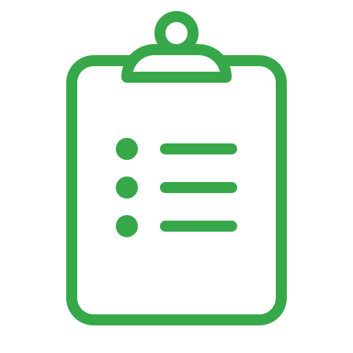

# TodoList4

### https://todo-list-4.netlify.app/

- Simple todo app that uses local storage
- This project was from [Brad Traversy's JS50 course](https://www.udemy.com/course/50-projects-50-days/)

 

